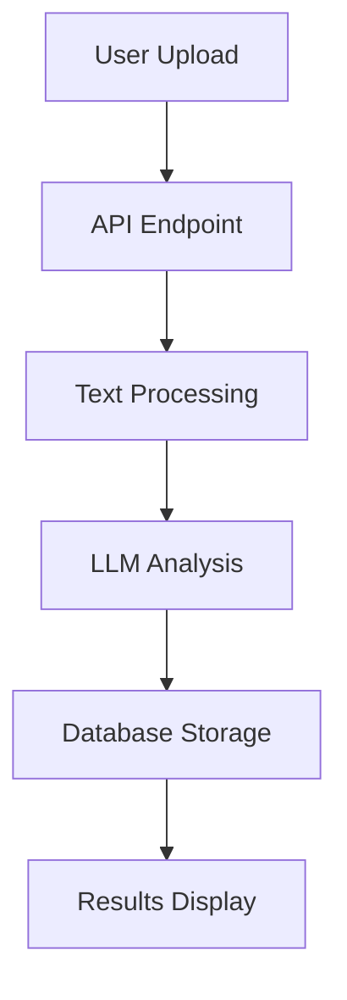

# Contract Scanner AI - System Design

## User Journey Moments

### 1. Onboarding & Authentication
**Moment: First Visit**
- User lands on homepage
- Sees value proposition
- CTA to sign up/sign in

**Moment: Sign Up**
- User clicks sign up
- Clerk handles registration
- User redirected to onboarding

**Moment: Sign In**
- User clicks sign in
- Clerk handles authentication
- User redirected to dashboard

### 2. Contract Analysis
**Moment: Contract Upload**
- User clicks "Analyze Contract"
- Chooses upload method (text/PDF)
- Enters contract details
- Submits for analysis

**Moment: Analysis Processing**
- System processes contract
- Shows loading state
- Updates progress
- Handles errors gracefully

**Moment: Results Display**
- Shows analysis summary
- Displays risk level
- Lists key issues
- Provides recommendations

### 3. Contract Management
**Moment: Contract History**
- Shows all analyzed contracts
- Filtering options
- Search functionality
- Sort by date/risk

**Moment: Contract Details**
- Full contract text
- Analysis results
- Issue details
- Export options

## Technical Implementation

### 1. Database Schema
```prisma
model User {
  id                String    @id @default(cuid())
  clerkId           String    @unique
  email             String    @unique
  subscriptionStatus String   @default("FREE")
  contracts         Contract[]
  createdAt         DateTime  @default(now())
  updatedAt         DateTime  @updatedAt
}

model Contract {
  id                String    @id @default(cuid())
  userId            String
  title             String
  originalText      String    @db.Text
  riskLevel         String
  contractType      String
  metadata          Json?
  recommendedActions String[]
  complianceFlags   String[]
  issues            ContractIssue[]
  user              User      @relation(fields: [userId], references: [id])
  createdAt         DateTime  @default(now())
  updatedAt         DateTime  @updatedAt
}

model ContractIssue {
  id              String   @id @default(cuid())
  contractId      String
  type            String
  text            String
  explanation     String
  suggestion      String
  severity        String
  severityScore   Int
  metadata        Json?
  contract        Contract @relation(fields: [contractId], references: [id])
  createdAt       DateTime @default(now())
  updatedAt       DateTime @updatedAt
}
```

### 2. API Flow


### 3. LLM Integration
**Analysis Pipeline:**
1. Text Preprocessing
   - Clean input
   - Extract key sections
   - Format for LLM

2. LLM Analysis
   - Risk assessment
   - Issue identification
   - Recommendations
   - Compliance checks

3. Results Processing
   - Structure output
   - Calculate scores
   - Generate summaries

### 4. Frontend Components
1. **Dashboard**
   - Contract list
   - Upload form
   - Analysis history

2. **Analysis Results**
   - Risk overview
   - Issue list
   - Recommendations
   - Export options

3. **Contract Details**
   - Full text view
   - Analysis highlights
   - Issue details
   - Action items

## Implementation Steps

### 1. Fix Contract Analysis
1. Update API route
2. Improve error handling
3. Add proper logging
4. Validate input

### 2. Fix Contract Storage
1. Ensure proper database connection
2. Validate data before saving
3. Handle relationships correctly
4. Add error recovery

### 3. Fix Contract Retrieval
1. Update GET endpoint
2. Add proper authentication
3. Handle missing contracts
4. Improve error messages

### 4. Improve User Experience
1. Add loading states
2. Improve error messages
3. Add success notifications
4. Implement proper routing

## Error Handling
1. **Authentication Errors**
   - Handle session expiry
   - Redirect to login
   - Clear invalid tokens

2. **Analysis Errors**
   - Retry mechanism
   - Fallback analysis
   - User notifications

3. **Database Errors**
   - Connection retry
   - Transaction rollback
   - Data validation

## Monitoring & Logging
1. **Application Logs**
   - Request tracking
   - Error logging
   - Performance metrics

2. **User Analytics**
   - Usage patterns
   - Error rates
   - Performance metrics

## Security Considerations
1. **Data Protection**
   - Encrypt sensitive data
   - Validate input
   - Sanitize output

2. **Access Control**
   - Role-based access
   - Resource ownership
   - API rate limiting

## Future Improvements
1. **Feature Additions**
   - Batch processing
   - Custom templates
   - Advanced analytics

2. **Performance**
   - Caching
   - Background jobs
   - Optimized queries

3. **User Experience**
   - Mobile optimization
   - Dark mode
   - Accessibility 